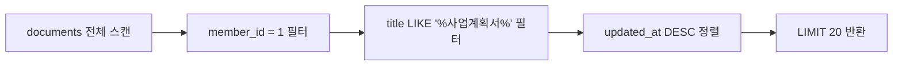
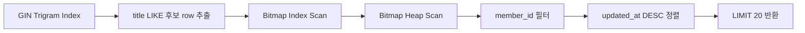

# pg_trgm 검색 성능 실행계획 비교

## 1. 테스트 목적

- 기존 `LIKE '%keyword%'` 검색, `pg_trgm` extension 설치, `pg_trgm + GIN index` 적용 상태를 같은 데이터셋에서 비교하였다.
- 단순 API 응답 시간이 아니라 PostgreSQL `EXPLAIN ANALYZE` 실행계획을 기준으로 비교하였다.
- 핵심 확인 대상은 `pg_trgm` 설치 자체가 아니라, `GIN index + gin_trgm_ops` 적용 이후 실행계획이 실제로 바뀌는지였다.

## 2. 테스트 환경

| 항목 | 값 |
| --- | --- |
| DB | PostgreSQL 16 Alpine Docker 컨테이너 |
| 전체 문서 수 | 200,000건 |
| 검색 대상 회원 문서 수 | 100,000건 |
| 다른 회원 문서 수 | 100,000건 |
| 검색어 | `사업계획서` |
| 매칭 문서 수 | 1,200건 |
| 비교 도구 | `EXPLAIN (ANALYZE, BUFFERS)` |

## 3. 비교 대상

| 단계 | DB 상태 | 실행 쿼리 |
| --- | --- | --- |
| 1 | 기본 B-Tree index만 존재 | `title LIKE '%사업계획서%'` |
| 2 | `pg_trgm` extension만 설치 | `title LIKE '%사업계획서%'` |
| 3 | `pg_trgm + GIN index` 적용 | `title LIKE '%사업계획서%'` |
| 4 | `pg_trgm` extension만 설치 | `title % '사업계획서'` |
| 5 | `pg_trgm + GIN index` 적용 | `title % '사업계획서'` |

## 4. 적용한 DB 설정

~~~sql
CREATE EXTENSION IF NOT EXISTS pg_trgm;

CREATE INDEX idx_documents_title_trgm
ON documents USING gin (title gin_trgm_ops);

CREATE INDEX idx_documents_keywords_trgm
ON documents USING gin (keywords gin_trgm_ops);
~~~

## 5. 결과 요약

| 단계 | Scan 방식 | Rows Removed by Filter | Buffer hit | Execution Time | 해석 |
| --- | --- | ---: | ---: | ---: | --- |
| 기존 LIKE | `Parallel Seq Scan` | 99,400 x 2 | 1,914 | 10.003ms | 전체 문서를 순차 스캔 |
| pg_trgm 설치만 + LIKE | `Parallel Seq Scan` | 99,400 x 2 | 1,914 | 9.828ms | extension만으로는 실행계획 변화 없음 |
| pg_trgm + GIN + LIKE | `Bitmap Index Scan -> Bitmap Heap Scan` | 없음 | 953 | 4.621ms | GIN index로 후보를 먼저 좁힘 |
| pg_trgm 설치만 + 유사도 검색 | `Parallel Seq Scan` | 99,400 x 2 | 1,923 | 119.043ms | 유사도 계산을 전체 row에 수행해 가장 느림 |
| pg_trgm + GIN + 유사도 검색 | `Bitmap Index Scan -> Bitmap Heap Scan` | 없음 | 962 | 11.937ms | `%` 연산자가 GIN index를 사용 |

## 6. 기존 LIKE 검색 실행계획

| 항목 | 결과 |
| --- | --- |
| 주요 Scan | `Parallel Seq Scan on documents` |
| Filter | `title ~~ '%사업계획서%' AND member_id = 1` |
| Rows Removed by Filter | `99400` per worker |
| Sort | `top-N heapsort` |
| Buffer hit | `1914` |
| Execution Time | `10.003ms` |

## 7. pg_trgm 설치만 적용한 LIKE 검색 실행계획

| 항목 | 결과 |
| --- | --- |
| 주요 Scan | `Parallel Seq Scan on documents` |
| Filter | `title ~~ '%사업계획서%' AND member_id = 1` |
| Rows Removed by Filter | `99400` per worker |
| Buffer hit | `1914` |
| Execution Time | `9.828ms` |

- 기존 LIKE 검색과 실행계획이 거의 동일하였다.
- `pg_trgm` extension은 trigram 함수와 연산자를 활성화할 뿐, 검색에 사용할 물리적인 인덱스 자료구조를 자동으로 만들지는 않는다.
- 따라서 extension 설치만으로는 성능 개선을 기대하기 어렵다.

## 8. pg_trgm + GIN index 적용 후 LIKE 검색 실행계획

| 항목 | 결과 |
| --- | --- |
| 주요 Scan | `Bitmap Index Scan on idx_documents_title_trgm` |
| Heap Scan | `Bitmap Heap Scan on documents` |
| Recheck Cond | `title ~~ '%사업계획서%'` |
| Heap Blocks | `exact=943` |
| Buffer hit | `953` |
| Execution Time | `4.621ms` |

- `Seq Scan`이 사라지고 `Bitmap Index Scan`이 사용되었다.
- Buffer hit가 `1914 -> 953`으로 감소하였다.
- 실행 시간은 `10.003ms -> 4.621ms`로 약 `53.8%` 감소하였다.

## 9. 유사도 검색 실행계획 비교

유사도 검색은 아래 조건을 사용하였다.

~~~sql
SELECT id, title, similarity(title, '사업계획서') AS score
FROM documents
WHERE member_id = 1
  AND title % '사업계획서'
ORDER BY score DESC, title ASC
LIMIT 20;
~~~

| 상태 | Scan 방식 | Buffer hit | Execution Time | 해석 |
| --- | --- | ---: | ---: | --- |
| pg_trgm 설치만 | `Parallel Seq Scan` | 1,923 | 119.043ms | 전체 row에 trigram 유사도 판단 수행 |
| pg_trgm + GIN index | `Bitmap Index Scan -> Bitmap Heap Scan` | 962 | 11.937ms | `%` 연산자가 GIN index를 사용 |

- 유사도 검색은 extension만 설치하면 오히려 기존 LIKE보다 훨씬 느릴 수 있다.
- 이유는 인덱스 없이 전체 row에 대해 trigram 유사도 연산을 수행하기 때문이다.
- GIN index를 추가하면 `title % '사업계획서'` 조건이 `idx_documents_title_trgm`을 사용한다.
- 실행 시간은 `119.043ms -> 11.937ms`로 약 `90.0%` 감소하였다.

## 10. 결론

| 결론 | 근거 |
| --- | --- |
| `pg_trgm` 설치만으로는 검색이 빨라지지 않는다. | LIKE 검색이 여전히 `Parallel Seq Scan`을 사용했다. |
| 성능 개선의 핵심은 GIN index다. | GIN index 적용 후 `Bitmap Index Scan`이 사용되었다. |
| `%keyword%` 포함 검색도 trigram index의 이점을 받을 수 있다. | `LIKE '%사업계획서%'`가 `idx_documents_title_trgm`을 사용했다. |
| 유사도 검색은 GIN index 없이 쓰면 위험하다. | extension만 설치한 유사도 검색은 `119.043ms`까지 증가했다. |
| 관련 검색어 추천 API는 GIN index와 함께 운영해야 한다. | `%` 연산자가 GIN index를 사용할 때만 후보군을 빠르게 좁힐 수 있다. |

이번 비교를 통해 “`pg_trgm`을 설치해서 빨라졌다”가 아니라, “`pg_trgm`이 제공하는 `gin_trgm_ops`를 GIN index에 적용했기 때문에 포함 검색과 유사도 검색이 인덱스를 탈 수 있게 되었다”가 정확한 결론이다.
