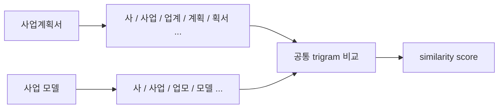
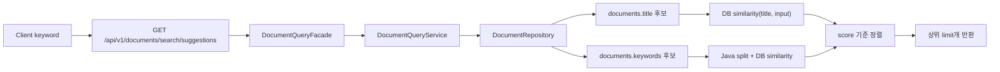

# pg_trgm 기반 문서 검색 최적화

## 1. 왜 도입했는가

- 기존 문서 검색은 제목 기준 `LIKE '%keyword%'` 검색에 가까운 구조였다.
- 이 방식은 사용자가 입력한 검색어가 제목에 그대로 포함되어 있을 때는 동작하지만, 유사한 표현이나 일부 오타에 약하다.
- 또한 `%keyword%` 형태의 포함 검색은 일반 B-Tree 인덱스를 효과적으로 활용하기 어렵다.
- 그래서 PostgreSQL의 `pg_trgm`을 활용하여 아래 두 가지를 개선하였다.

| 개선 대상 | 기존 방식 | 개선 방식 |
| --- | --- | --- |
| 문서 제목 포함 검색 | `LIKE` 기반 검색 | GIN Trigram 인덱스로 `LIKE` 검색 가속 |
| 관련 검색어 추천 | 없음 | `similarity()` 점수 기반 추천 |

## 2. pg_trgm이 무엇인가

- `pg_trgm`은 문자열을 3글자 단위 조각인 trigram으로 나누어 비교하는 PostgreSQL 확장 기능이다.
- 두 문자열이 얼마나 많은 trigram을 공유하는지를 기반으로 유사도를 계산한다.



## 3. 이번 구현에서 활용한 기능

| 기능 | 사용 위치 | 목적 |
| --- | --- | --- |
| `CREATE EXTENSION pg_trgm` | DB 초기화 | trigram 함수와 연산자 활성화 |
| `GIN (... gin_trgm_ops)` | `documents.title`, `documents.keywords` | 포함 검색과 유사도 검색 성능 개선 |
| `%` 연산자 | 추천 후보 필터링 | 유사도가 임계치 이상인 문자열만 후보로 사용 |
| `similarity(a, b)` | 제목 추천 점수 계산 | 검색어와 문서 제목의 관련도 계산 |
| QueryDSL `numberTemplate` | 제목 유사도 함수 호출 | QueryDSL에서 PostgreSQL `similarity()` 호출 |
| QueryDSL `booleanTemplate` | 유사 후보 필터링 | QueryDSL에서 PostgreSQL `%` 연산자 호출 |
| Java comma split | AI 키워드 분해 | `keywords` 컬럼 값을 애플리케이션에서 comma 기준으로 분리한 뒤 QueryDSL로 DB `similarity()`를 호출 |

## 4. DB 설정

애플리케이션 시작 시 `app.search.pg-trgm.enabled=true`이면 아래 설정을 적용한다.

```sql
CREATE EXTENSION IF NOT EXISTS pg_trgm;

CREATE INDEX IF NOT EXISTS idx_documents_title_trgm
ON documents USING gin (title gin_trgm_ops);

CREATE INDEX IF NOT EXISTS idx_documents_keywords_trgm
ON documents USING gin (keywords gin_trgm_ops);
```

## 5. 관련 검색어 추천 흐름



## 6. 추천어 후보 기준

| 후보 | 설명 |
| --- | --- |
| 문서 제목 | 사용자가 직접 작성한 문서 제목을 추천어로 사용한다. |
| AI 키워드 | 외부 AI가 문서에서 추출한 `keywords` 값을 comma 기준으로 분리해 추천어로 사용한다. |

## 7. API 계약

| 항목 | 값 |
| --- | --- |
| Method | `GET` |
| Path | `/api/v1/documents/search/suggestions` |
| Query | `keyword`, `limit` |
| 기본 limit | `5` |
| 최대 limit | `10` |
| 최소 검색어 길이 | `2` |

응답 예시는 아래와 같다.

```json
{
  "success": true,
  "code": "COMMON200",
  "message": "관련 검색어가 조회되었습니다",
  "result": [
    {
      "keyword": "사업계획서",
      "score": 0.72
    },
    {
      "keyword": "사업 모델",
      "score": 0.61
    }
  ]
}
```

## 8. 주의사항

| 주의점 | 설명 |
| --- | --- |
| 개인 문서 범위 제한 | 추천어는 반드시 `member_id` 기준으로 본인 문서에서만 생성한다. |
| 짧은 검색어 | 한 글자 검색어는 trigram 유사도 품질이 낮아 빈 목록을 반환한다. |
| score threshold | 기본적으로 `0.2` 이상의 후보만 반환한다. |
| Elasticsearch와의 관계 | pg_trgm은 PostgreSQL 내부에서 가능한 중간 단계 최적화이며, 검색 요구가 커지면 Elasticsearch로 확장할 수 있다. |
